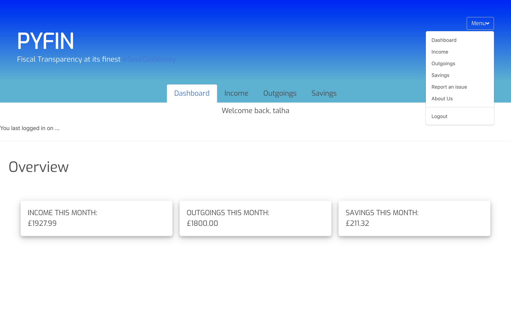

# Software Engineering Immersive: Project 4

Fourth and final project undertaken during the General Assembly Software Engineering Immersive course (week 11).

---

# Pyfin Financial Planner

## Brief
This final project was an opportunity to explore the development of a full-stack application which was rooted in a Python back-end. We were provided the option to either work in pairs/groups or our own, with a focus on quality code over quantity. I opted to use this opportunity as a means to test my own learning and showcase my abilities so far. 

## Goal
To build a full-stack application by making my own backend and my own front-end, 
using a Python Flask API to serve my data from a Postgres SQL database. In addition I needed to consume my API with a separate front-end built with React. 
The final complete product should also consist of multiple relationships and CRUD functionality for at least a couple of models, while implementing thoughtful user stories/wireframes.

## Timeframe & Team
7 days solo project.

## Technologies Used
* **Front-end**
	* React
	* Bulma (css framework)
* **Back-end**
	* Python
	* Flask
	* PostgreSQL
	* SQLAlchemy

## Stack Overview: Front-End
#### Homepage
The homepage is a landing page for any user of the site, whether signed up or not. From this page they are able to register or log in to their existing site. 

#### User Dashboard
Upon registering and logging in, the user is taken to their profile dashboard where they are presented with an overview of their financial status. 

This is the default view page where the main components to a users financial data resides. It is from the dashboard that they are able to navigate to and edit individual financial aspects to calculate an accurate overview. These include 'Income', 'Outgoings' and 'Savings'. Note that said navigation is also available via the hover dropdown 'Menu' in the top right corner.

#### Income Page
The income page provides valuable insight into the users annual and monthly income. 

After prompting a user to enter their gross annual salary, the salary calculator built into the back-end presents the user with a clear breakdown of their 'after tax income' in both annual and monthly terms. This includes the likes of deductable Income Tax and National Insurance based on the users entered gross income. If the users income level changes they can always click the pencil icon to edit their declared income to receive a revised calculation. 

#### Outgoing Page
The outgoing page provides valuable insight into the users monthly outgoings broken down into various categories. 
 

The outgoings page allows a user to enter all of their monthly outgoings and categorise them into the variety of common categories provided or create their own. After populating the relevant fields the user is provided with a total of their outgoings for that particular month.

#### Savings Page
The Savings page provides the user with a valuable overview of their total savings.

The total savings is presented to the user as a culmination of the following. The balance after accounting for monthly outgoings from income, pension contributions from the users income tax and any other savings declared from the users outgoings or income. 

## Stack Overview: Back-End
#### Database Design
The database was modeled after the following relationship;

#### Routes
|            Route           | Method |             Description             |
|:--------------------------:|:------:|:-----------------------------------:|
| Authorisation              |        |                                     |
| /register                  |  POST  | Register a user                     |
| /login                     |  POST  | Login a user by issuing a jwt token |
| User (secured route)       |        |                                     |
| /profile                   |   GET  | Get all profiles                    |
| /profile/<profile_id>      |   GET  | Get profile data                    |
| Salary (secured route)     |        |                                     |
| /salary                    |   GET  | Get Salary Calculator               |
| /salary                    |  POST  | Post Gross Salary for Calculation   |
| /salary                    |   PUT  | Update Gross Salary for Calculation |
| Categories (secured route) |        |                                     |
| /category                  |   GET  | Get all categories and data         |
| /category                  |  POST  | Post Category data                  |
| /category                  |   PUT  | Update Category data                |

#### Salary Calculator
The salary calculation is served up entirely from the Python back-end. It consists of a 'Salary Model' and a 'Salary Schema' as shown in the code snippets below.

**Salary Schema:**
 

**Salary Model:**

These above models and their fields take into account all of the required data to accurately output a users net take home salary. When a user initiates a POST request on the /salary URL the following function as shown in the code snippet is run. 

**Salary Calculation:**

## Process
Upon determining my required models as per the database design above, I set about creating the individual models and their relationships. Following this I created all of the associated controllers and routes for the models. This entire process was very reminicent of the MERN app I had developed prior see [here](http://bit.ly/sei-project-3). The change in syntax from JavaScript to Python did prove to be an adjustment to begin with but was quickly overcome allowing me to incoporate my more desired functionality. 

Upon satisfaction completion of the Python back-end I proceeded to attach a front-end in ReactJS with relative ease. In similar fashion to the MERN app I proceeded to build out the CRUD route components for all of the defined models in Python first then linked together the back-end calculation functionality by initiating the appropriate axios request to the relevant api endpoint url.
 
## Challenges
My biggest hurdle revolved around the relatively new syntax used in Python and therefore adapting myself to this language. This proved particularly challenging when trying to interpret my salary calculation functions from JavaScript to Python, such as linking relatively simple SQL expressions to a class using a 'hybrid attribute'.   

## Wins
I had set out on this project to test my own capabilities in an entirely new back-end language and am very proud of the full stack application that I have created. This entire project was born out of the desire to provide more fiscal transparancy to individuals by providing a sort of 'blank slate' on which to achieve this. 

## Key Learnings
I learned a lot during this project, especially in relation to utilising Flask with Python and its benefits over using Express with NodeJS. Particularly its potential for usecases beyond the web application realm such as DevOps and automation scripts. 
  
## Future Improvements
While there is potential for large scale development with this project, I would very much like to develop my skills further with 'OAuth' by implementing third-party integration functionality with modern digital banks such as Monzo, Revolut and Starling. The aim would be to allow users to securely integrate their personal account spending directly into the web app and allowing them a means to organise and allocate their spending and income. 